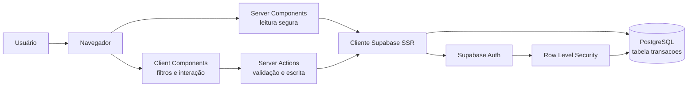

# Clareza — Controle financeiro pessoal

Aplicação web full-stack para registrar receitas e despesas, acompanhar o saldo e entender os hábitos financeiros. O projeto demonstra, de forma prática, o uso do **Next.js App Router**, **Server Components**, **Client Components**, **Server Actions**, **PostgreSQL/Supabase** e publicação na **Vercel**.

## Projeto publicado

- **Aplicação:** [clareza-financas-khaki.vercel.app](https://clareza-financas-khaki.vercel.app)
- **Banco de dados:** PostgreSQL gerenciado pelo Supabase
- **Autenticação:** e-mail e senha, com confirmação de cadastro
- **Segurança:** Row Level Security (RLS) para separar os dados de cada usuário

## Requisitos atendidos

| Requisito             | Implementação                                                    |
| --------------------- | ---------------------------------------------------------------- |
| Painel de resumo      | Saldo acumulado, receitas do mês e despesas do mês               |
| Gestão de transações  | Formulário com descrição, valor, tipo, categoria e data          |
| Histórico             | Lista cronológica, busca, filtro por tipo e diferenciação visual |
| Persistência          | PostgreSQL hospedado no Supabase                                 |
| Integração full-stack | Server Components para leitura e Server Actions para escrita     |
| Segurança             | Sessão validada no servidor e políticas RLS no banco             |
| Responsividade        | Interface adaptada para desktop, tablet e celular                |
| Nuvem                 | Frontend na Vercel e banco/autenticação no Supabase              |

## Arquitetura



O fluxo de leitura começa em `app/dashboard/page.tsx`. Esse Server Component confirma a sessão, consulta o histórico no Supabase e envia apenas os dados necessários ao painel. Assim, a consulta ao banco e os cookies de autenticação permanecem no servidor.

O fluxo de escrita começa no formulário cliente. O React envia o `FormData` para `createTransaction`, uma Server Action em `app/actions.ts`. A action valida os dados, confirma novamente o usuário, grava a transação e executa `revalidatePath` para atualizar o painel.

As interações que dependem do navegador ficam nos Client Components: mudança de mês, busca, filtro, paginação visual e alternância entre resumo e histórico. Totais, filtros e agrupamentos são funções puras em `lib/finance.ts`.

## Organização do código

| Caminho                           | Responsabilidade                                           |
| --------------------------------- | ---------------------------------------------------------- |
| `app/dashboard/page.tsx`          | Server Component que autentica e carrega os dados          |
| `app/actions.ts`                  | Server Actions de cadastro, login, logout e nova transação |
| `components/dashboard.tsx`        | Estado interativo e composição do painel                   |
| `components/dashboard/*`          | Sidebar, cartões, histórico e indicadores visuais          |
| `components/transaction-form.tsx` | Formulário cliente conectado à Server Action               |
| `lib/finance.ts`                  | Tipos, dinheiro em centavos, filtros, totais e gráfico     |
| `lib/validation.ts`               | Validação centralizada dos formulários no servidor         |
| `lib/transactions.ts`             | Consulta paginada do histórico no Supabase                 |
| `lib/supabase.ts`                 | Cliente Supabase SSR e integração com cookies              |
| `proxy.ts`                        | Renovação da sessão em páginas protegidas                  |
| `supabase/schema.sql`             | Tabela, restrições, índice, permissões e políticas RLS     |

### Por que Server e Client Components?

- **Server Components** acessam dados privados diretamente no servidor, reduzem JavaScript enviado ao navegador e evitam expor a lógica de consulta.
- **Client Components** são usados somente onde existe estado local ou evento do usuário.
- **Server Actions** eliminam uma rota REST manual para cada formulário e mantêm validação, autenticação e escrita no servidor.

### Decisões importantes

- Valores são calculados em **centavos** para evitar erros de ponto flutuante.
- O campo `data` define o mês financeiro; `criado_em` registra o instante de inserção.
- O saldo usa todo o histórico. Receitas, despesas e gráfico usam o mês selecionado.
- A consulta percorre páginas de 1.000 linhas para o limite padrão do Supabase não alterar o saldo.
- Sem variáveis do Supabase, a aplicação entra em modo de demonstração com dados fictícios somente para leitura.

## Banco de dados e segurança

A tabela `transacoes` contém:

| Campo       | Tipo          | Regra                                 |
| ----------- | ------------- | ------------------------------------- |
| `id`        | UUID          | Chave primária gerada automaticamente |
| `user_id`   | UUID          | Referência ao usuário autenticado     |
| `descricao` | Text          | Entre 2 e 120 caracteres              |
| `valor`     | Numeric(11,2) | Positivo e limitado pela aplicação    |
| `tipo`      | Text          | `receita` ou `despesa`                |
| `categoria` | Text          | Uma das categorias permitidas         |
| `data`      | Date          | Data financeira da movimentação       |
| `criado_em` | Timestamptz   | Momento da inserção                   |

As políticas RLS usam `auth.uid() = user_id`. Mesmo que uma requisição seja alterada no navegador, o banco permite ler e inserir somente registros ligados ao usuário autenticado. A aplicação usa a chave pública do Supabase; uma chave `service_role` não deve ser usada.

## Executar localmente

Requer Node.js 22.18 ou superior e npm. Node.js 24 é recomendado.

```sh
npm install
cp .env.example .env.local
npm run dev
```

No PowerShell:

```powershell
Copy-Item .env.example .env.local
npm run dev
```

Abra [http://localhost:3000](http://localhost:3000).

### Configurar o Supabase

1. Crie um projeto no Supabase.
2. Execute `supabase/schema.sql` no SQL Editor.
3. Copie a URL e a chave pública `anon` ou `publishable` para `.env.local`:

```dotenv
NEXT_PUBLIC_SUPABASE_URL=https://SEU-PROJETO.supabase.co
NEXT_PUBLIC_SUPABASE_ANON_KEY=SUA-CHAVE-PUBLICA
```

4. Em **Authentication**, habilite Email/password.
5. Configure a Site URL para `http://localhost:3000` e adicione o domínio da Vercel em produção.
6. Reinicie o servidor.

O arquivo `.env.local` é ignorado pelo Git.

## Segurança do repositório

- Credenciais locais, tokens da Vercel e artefatos de build estão no `.gitignore`.
- O repositório contém somente `.env.example`, sem valores reais.
- A chave pública do Supabase pode ser usada no cliente porque o acesso aos dados é limitado por autenticação e RLS.
- Nunca adicione ao projeto a chave `service_role`, senhas ou tokens pessoais.

## Verificação

```sh
npm run lint
npm run typecheck
npm test
npm run build
```

Para validar a integração real, crie duas contas. Registre dados na primeira e confirme que a segunda não consegue vê-los. Teste também confirmação de e-mail, valor inválido, recarregamento da página e logout.

## Roteiro de apresentação

Tempo sugerido: **8 a 10 minutos**.

### 1. Problema e objetivo — 45 segundos

> “O Clareza é uma aplicação de finanças pessoais criada para reunir receitas, despesas e saldo em uma interface simples. O objetivo técnico foi aplicar a arquitetura moderna do Next.js e integrar frontend, backend, banco, autenticação e nuvem.”

Mostre a tela inicial e explique rapidamente os três requisitos centrais: resumo, cadastro e histórico.

### 2. Tecnologias — 45 segundos

Apresente a stack:

- Next.js com App Router e TypeScript;
- React para a interface;
- Supabase para PostgreSQL e autenticação;
- Vercel para hospedagem;
- ESLint e testes nativos do Node.js para qualidade.

### 3. Arquitetura — 1 minuto e 30 segundos

Use o diagrama deste README. Explique:

1. o Server Component verifica o usuário e consulta o banco;
2. o Client Component controla somente as interações;
3. a Server Action recebe e valida o formulário;
4. o Supabase aplica RLS antes de acessar cada registro.

Abra `app/dashboard/page.tsx`, `components/dashboard.tsx` e `app/actions.ts` para mostrar essa separação.

### 4. Banco e segurança — 1 minuto

Abra `supabase/schema.sql`. Destaque a chave estrangeira `user_id`, as restrições de integridade, o índice por usuário/data e as duas políticas RLS. Explique que a segurança existe no banco e também na Server Action.

### 5. Demonstração funcional — 3 minutos

Siga esta ordem:

1. entre com uma conta confirmada;
2. mostre saldo, receitas e despesas;
3. altere o mês;
4. filtre por receita ou despesa;
5. pesquise uma descrição;
6. cadastre uma nova despesa;
7. volte ao painel e mostre a atualização do total, histórico e gráfico;
8. recarregue a página para comprovar a persistência;
9. encerre a sessão.

Use previamente uma conta com algumas transações. Também deixe uma descrição e um valor de teste preparados para evitar digitação demorada.

### 6. Qualidade e validação — 45 segundos

Mostre os comandos da seção **Verificação** e explique que:

- a validação visual melhora a experiência;
- a validação da Server Action protege a entrada;
- as restrições SQL formam a última camada de integridade;
- os testes cobrem a lógica monetária.

### 7. Publicação e conclusão — 45 segundos

Abra a aplicação na Vercel e o projeto no Supabase. Encerre com:

> “O resultado é uma aplicação full-stack publicada, com responsabilidades bem separadas, autenticação real, dados persistentes e isolamento por usuário. Como evolução, eu adicionaria edição, exclusão, metas mensais e agregações SQL para grandes volumes.”

## Perguntas que podem surgir

**Por que usar Server Actions?**

Elas permitem processar formulários no servidor sem criar manualmente uma API REST, mantendo validação e autenticação próximas da escrita.

**A chave pública do Supabase é segura no navegador?**

Sim, desde que o RLS esteja corretamente configurado. A chave pública identifica o projeto; as políticas do banco determinam o que cada usuário pode acessar.

**Por que calcular valores em centavos?**

Números decimais em JavaScript podem acumular imprecisões. Inteiros em centavos mantêm os totais previsíveis.

**Por que o dashboard tem uma parte cliente?**

Busca, filtros e troca de mês precisam responder a eventos do usuário. A leitura privada continua no Server Component.

**O que mudaria com muitos registros?**

Os totais e agrupamentos passariam para consultas SQL, views ou funções do PostgreSQL, e o histórico teria paginação no servidor.

## Publicar na Vercel

Importe o repositório como um projeto Next.js, configure as duas variáveis do Supabase e faça o deploy. Depois, adicione o domínio publicado às URLs permitidas no Supabase Authentication. O SQL deve ser executado antes do primeiro uso.

Referências: [Server and Client Components](https://nextjs.org/docs/app/getting-started/server-and-client-components), [Server Actions](https://nextjs.org/docs/app/getting-started/mutating-data) e [Supabase SSR](https://supabase.com/docs/guides/auth/server-side/creating-a-client).

## Licença

Distribuído sob a licença MIT. Consulte [LICENSE](LICENSE).
